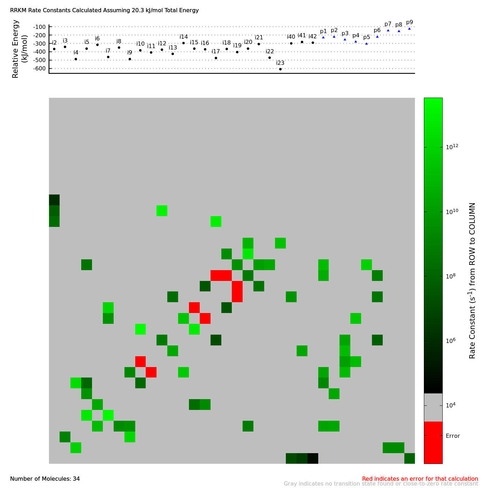

# RRKM Branching Ratios
Code and guide towards predicting branching ratios of reactions using RRKM theory. All steps require fortran. The rate constant matrix calculation requires the LAPACK standard software library for fortran. The visualization step requires gnuplot.

### Calculating Rate Constants of Elementary Reactions with RRKM Theory

Here, we make use of the RRKM calculations made available from (Zhu,1993) in the fortran executable `rrkm.f` provided in the folder. This code makes use of an input file, in which a general-use version is given as `input.rrkm`. An example for how to fill out the input file is given in the executable `exampleRateConstantCalculation.sh`, with the execution and output provided below.

```bash
./exampleRateConstantCalculation.sh > exampleRateConstantCalculation.out
```

<details><summary>exampleRateConstantCalculation.out</summary>
<p>

```text
comment line 1 - Frequencies must be in cm^-1, Temperatures must be in Kelvin   
comment line 2 - Energies are relative to the intermediate and must be in kcal/m

EMIN =  58.10  KCAL/MOLE  DELE =   0.50  KCAL/MOLE  NE =    5

    5  RATE CONSTANTS TO BE CALCULATED     REACTION PATH DEGENERCY = 1.0


                    ***************************
                    *  DATA FOR THE MOLECULE  *
                    ***************************

NUMBER OF OSCILLATORS     NUMBER OF INTERNAL ROTORS

         24                         0

FREQUENCIES     1/CM

      3144.0      3133.0      3125.0      3063.0      3060.0      3045.0      1537.0
      1529.0      1516.0      1442.0      1402.0      1361.0      1347.0      1246.0
      1179.0      1157.0      1088.0      1014.0       970.0       938.0       912.0
       842.0       739.0       719.0

MOMENTS OF INERTIA     AMU*ANGSTROM**2

    174.00    174.00     73.00


ROTATIONAL TEMPERATURE IS    0.0000       J =     0


               ***********************************
               *  DATA FOR THE TRANSITION STATE  *
               ***********************************

*****STRUCTURE OF THE TRANSITION STATE IS SPECIFIED*****

POTENTIAL ENERGY     NUMBER OF OSCILLATORS     NUMBER OF INTERNAL ROTORS

    2.70                      23                         0

FREQUENCIES     1/CM

      3148.0      3139.0      3134.0      3066.0      3043.0      3031.0      1521.0
      1517.0      1513.0      1439.0      1416.0      1372.0      1334.0      1243.0
      1188.0      1166.0      1113.0      1045.0       982.0       943.0       886.0
       860.0       796.0

MOMENTS OF INERTIA     AMU*ANGSTROM**2

    181.00    181.00     69.00


XXXXXXXXXXXXXXXXXXXXXXXXXXXXXXXXXXXXXXXXXXXXXXXXXXXXXXXXXXXXXXXXXXXXXXXXXXXXXXXXXXXXXXXXXXXXXXXXXXXX

RATE CONSTANTS CALCULATED USING THESE OPTIONS:     KROT = 0  NANH = 0  NCRIT = 0  JDEN = -1  JSUM = -1


    E        J        DENSITY        SUM        RATE CONSTANT

 KCAL/MOLE            1/CM-1                      SECOND-1


  58.10       0      0.1074D+08    0.3015D+10     0.8412D+13
  58.60       0      0.1201D+08    0.3385D+10     0.8449D+13
  59.10       0      0.1342D+08    0.3798D+10     0.8486D+13
  59.60       0      0.1498D+08    0.4259D+10     0.8523D+13
  60.10       0      0.1672D+08    0.4773D+10     0.8560D+13


```
    
The example above demonstrated how the rate constant changed over five different total energies. Try tinkering with it to see how it changes with the relative energy of intermediate to transition state, frequencies, rotational energy, and moments of inertia.

</p>
</details>

### Calculate Rate Constants Over All Elementary Steps in a Reaction

Consider the bimolecular reaction of vinylacetylene with the methylidyne radical to produce a hydrogen atom:

<p align="center">
    CH + C<sub>4</sub>H<sub>4</sub> ⟶ C<sub>5</sub>H<sub>4</sub> + H
</p>

There are a number of possible elementary steps: reactants adding or inserting across bonds, intermediates isomerizing between one another, and bond(s) breaking to form products. This code handles isomerizations and reactant/product formation with barriers, meaning any elementary step accompanied with a transition state can have its rate constant calculated. To do so, the intermediates' and transition states' energies, geometries, and frequencies must be known, also known as the potential energy profile or surface (PES) of the system. An example PES is provided for the example C<sub>5</sub>H<sub>5</sub> system in the `C5H5` directory:

```bash
$ tree C5H5
C5H5
├── PES.dat
├── geometries-frequenciesANDzpe.txt
└── geometries/
```

For this code, information must be stored as follows: the energies in `PES.dat`, the frequencies and zero-point energies (ZPEs) in `geometries-frequenciesANDzpe.txt`, and a list of XYZ files with optimized geometries of each intermediate and transition state in `geometries/`. After specifying the total energy and rotational excitation of the system in the script `getRateConstantMatrix.sh`, it may be executed to produce the following output like so:

```bash
./getRateConstantMatrix.sh > rateConstantMatrix.dat
```

<details><summary>rateConstantMatrix.dat</summary>
<p>

```text
#i2 i3 i4 i5 i6 i7 i8 i9 i10 i11 i12 i13 i14 i15 i16 i17 i18 i19 i20 i21 i22 i23 i40 i41 i42 p1 p2 p3 p4 p5 p6 p7 p8 p9
                       i2           i3           i4           i5           i6           i7           i8           i9          i10          i11          i12          i13          i14          i15          i16          i17          i18          i19          i20          i21          i22          i23          i40          i41          i42           p1           p2           p3           p4           p5           p6           p7           p8           p9 
          i2          0.0          0.0          0.0          0.0          0.0          0.0          0.0          0.0          0.0          0.0          0.0          0.0          0.0          0.0          0.0          0.0          0.0          0.0          0.0          0.0          0.0          0.0   1.1370e+07   3.2660e+06   6.4850e+04          0.0          0.0          0.0          0.0          0.0          0.0          0.0          0.0   9.4850e+07 
          i3          0.0          0.0   8.6000e+11          0.0          0.0          0.0          0.0          0.0          0.0          0.0          0.0          0.0          0.0          0.0          0.0          0.0          0.0          0.0          0.0          0.0          0.0          0.0          0.0          0.0          0.0          0.0          0.0          0.0          0.0          0.0          0.0   2.2610e+09   2.4690e+09          0.0 
          i4          0.0   1.2370e+09          0.0          0.0          0.0          0.0          0.0   1.4940e+12          0.0          0.0          0.0          0.0          0.0          0.0          0.0          0.0          0.0          0.0          0.0          0.0          0.0          0.0          0.0          0.0          0.0          0.0          0.0          0.0          0.0          0.0          0.0          0.0          0.0          0.0 
          i5          0.0          0.0          0.0          0.0   1.4060e+11          0.0   2.4450e+09   3.8550e+09          0.0          0.0          0.0          0.0          0.0          0.0          0.0          0.0          0.0          0.0   6.6100e+08          0.0          0.0          0.0          0.0          0.0          0.0   1.8790e+10   2.4110e+10          0.0          0.0          0.0          0.0          0.0          0.0          0.0 
          i6          0.0          0.0          0.0   5.8960e+12          0.0   2.3910e+13          0.0          0.0          0.0          0.0          0.0          0.0          0.0          0.0          0.0          0.0          0.0          0.0          0.0          0.0          0.0          0.0          0.0          0.0          0.0          0.0          0.0          0.0          0.0          0.0          0.0          0.0          0.0          0.0 
          i7          0.0          0.0          0.0          0.0   3.0520e+10          0.0          0.0          0.0          0.0          0.0          0.0          0.0          0.0   2.0210e+08   2.1870e+09          0.0          0.0          0.0          0.0          0.0          0.0          0.0          0.0          0.0          0.0          0.0          0.0          0.0          0.0          0.0          0.0          0.0          0.0          0.0 
          i8          0.0          0.0          0.0   4.5010e+09          0.0          0.0          0.0          0.0          0.0          0.0          0.0          0.0          0.0          0.0          0.0          0.0          0.0          0.0          0.0          0.0          0.0          0.0          0.0          0.0          0.0          0.0   2.4520e+10          0.0          0.0          0.0          0.0          0.0          0.0          0.0 
          i9          0.0          0.0   2.2030e+12   1.0520e+08          0.0          0.0          0.0          0.0   1.4920e+08          0.0          0.0          0.0          0.0          0.0          0.0          0.0          0.0          0.0          0.0          0.0          0.0          0.0          0.0          0.0          0.0   1.7070e+09          0.0          0.0          0.0          0.0          0.0          0.0          0.0          0.0 
         i10          0.0          0.0          0.0          0.0          0.0          0.0          0.0   2.0330e+09          0.0        error          0.0          0.0   4.1480e+11          0.0          0.0          0.0          0.0          0.0          0.0          0.0          0.0          0.0          0.0          0.0          0.0   2.1830e+10          0.0   1.1920e+11          0.0          0.0          0.0          0.0          0.0          0.0 
         i11          0.0          0.0          0.0          0.0          0.0          0.0          0.0          0.0        error          0.0          0.0          0.0          0.0          0.0          0.0          0.0          0.0          0.0          0.0          0.0          0.0          0.0          0.0          0.0          0.0          0.0          0.0   1.2790e+10   1.4580e+11          0.0          0.0          0.0          0.0          0.0 
         i12          0.0          0.0          0.0          0.0          0.0          0.0          0.0          0.0          0.0          0.0          0.0   2.8810e+10          0.0          0.0          0.0          0.0          0.0          0.0          0.0          0.0          0.0          0.0          0.0   2.3170e+10          0.0          0.0          0.0   1.3510e+11          0.0          0.0          0.0          0.0          0.0          0.0 
         i13          0.0          0.0          0.0          0.0          0.0          0.0          0.0          0.0          0.0          0.0   5.2250e+08          0.0          0.0          0.0          0.0   1.3930e+07          0.0          0.0          0.0          0.0          0.0          0.0          0.0          0.0          0.0          0.0          0.0   2.1610e+10          0.0          0.0   6.4610e+07          0.0          0.0          0.0 
         i14          0.0          0.0          0.0          0.0          0.0          0.0          0.0          0.0   3.3860e+13          0.0          0.0          0.0          0.0   7.3150e+12          0.0          0.0          0.0          0.0          0.0          0.0          0.0          0.0          0.0          0.0          0.0          0.0          0.0          0.0          0.0          0.0          0.0          0.0          0.0          0.0 
         i15          0.0          0.0          0.0          0.0          0.0   4.6810e+09          0.0          0.0          0.0          0.0          0.0          0.0   2.9780e+11          0.0        error          0.0          0.0          0.0          0.0          0.0          0.0          0.0          0.0          0.0          0.0          0.0          0.0          0.0   3.9710e+11          0.0          0.0          0.0          0.0          0.0 
         i16          0.0          0.0          0.0          0.0          0.0   1.1260e+12          0.0          0.0          0.0          0.0          0.0          0.0          0.0        error          0.0          0.0   2.9390e+07          0.0          0.0          0.0          0.0          0.0          0.0          0.0          0.0          0.0          0.0          0.0          0.0          0.0          0.0          0.0          0.0          0.0 
         i17          0.0          0.0          0.0          0.0          0.0          0.0          0.0          0.0          0.0          0.0          0.0   1.8800e+08          0.0          0.0          0.0          0.0          0.0        error          0.0          0.0          0.0          0.0   4.7530e+09          0.0          0.0          0.0          0.0          0.0          0.0          0.0   3.7630e+08          0.0          0.0          0.0 
         i18          0.0          0.0          0.0          0.0          0.0          0.0          0.0          0.0          0.0          0.0          0.0          0.0          0.0          0.0   2.7840e+07          0.0          0.0        error          0.0   3.1940e+08          0.0          0.0          0.0          0.0          0.0          0.0          0.0          0.0          0.0          0.0          0.0          0.0          0.0          0.0 
         i19          0.0          0.0          0.0          0.0          0.0          0.0          0.0          0.0          0.0          0.0          0.0          0.0          0.0          0.0          0.0        error        error          0.0   5.4930e+08          0.0          0.0          0.0          0.0          0.0          0.0   4.3090e+10          0.0          0.0          0.0          0.0   8.2670e+08          0.0          0.0          0.0 
         i20          0.0          0.0          0.0   3.2690e+08          0.0          0.0          0.0          0.0          0.0          0.0          0.0          0.0          0.0          0.0          0.0          0.0          0.0   3.4590e+09          0.0   1.2530e+10   2.3080e+10          0.0          0.0          0.0          0.0   1.4790e+11          0.0          0.0          0.0   7.4230e+11          0.0          0.0          0.0          0.0 
         i21          0.0          0.0          0.0          0.0          0.0          0.0          0.0          0.0          0.0          0.0          0.0          0.0          0.0          0.0          0.0          0.0   2.6790e+09          0.0   5.5230e+12          0.0          0.0          0.0          0.0          0.0          0.0          0.0          0.0          0.0          0.0          0.0          0.0          0.0          0.0          0.0 
         i22          0.0          0.0          0.0          0.0          0.0          0.0          0.0          0.0          0.0          0.0          0.0          0.0          0.0          0.0          0.0          0.0          0.0          0.0   9.1510e+10          0.0          0.0   2.3710e+11          0.0          0.0          0.0          0.0          0.0          0.0          0.0          0.0          0.0          0.0          0.0          0.0 
         i23          0.0          0.0          0.0          0.0          0.0          0.0          0.0          0.0          0.0          0.0          0.0          0.0          0.0          0.0          0.0          0.0          0.0          0.0          0.0          0.0   0.0000e+00          0.0          0.0          0.0          0.0          0.0          0.0          0.0          0.0          0.0          0.0          0.0          0.0          0.0 
         i40   1.7250e+08          0.0          0.0          0.0          0.0          0.0          0.0          0.0          0.0          0.0          0.0          0.0          0.0          0.0          0.0   1.0420e+13          0.0          0.0          0.0          0.0          0.0          0.0          0.0          0.0          0.0          0.0          0.0          0.0          0.0          0.0          0.0          0.0          0.0          0.0 
         i41   5.6920e+07          0.0          0.0          0.0          0.0          0.0          0.0          0.0          0.0          0.0   1.4320e+13          0.0          0.0          0.0          0.0          0.0          0.0          0.0          0.0          0.0          0.0          0.0          0.0          0.0          0.0          0.0          0.0          0.0          0.0          0.0          0.0          0.0          0.0          0.0 
         i42   9.8030e+05          0.0          0.0          0.0          0.0          0.0          0.0          0.0          0.0          0.0          0.0          0.0          0.0          0.0          0.0          0.0          0.0          0.0          0.0          0.0          0.0          0.0          0.0          0.0          0.0          0.0          0.0          0.0          0.0          0.0          0.0          0.0          0.0          0.0 
          p1          0.0          0.0          0.0          0.0          0.0          0.0          0.0          0.0          0.0          0.0          0.0          0.0          0.0          0.0          0.0          0.0          0.0          0.0          0.0          0.0          0.0          0.0          0.0          0.0          0.0          0.0          0.0          0.0          0.0          0.0          0.0          0.0          0.0          0.0 
          p2          0.0          0.0          0.0          0.0          0.0          0.0          0.0          0.0          0.0          0.0          0.0          0.0          0.0          0.0          0.0          0.0          0.0          0.0          0.0          0.0          0.0          0.0          0.0          0.0          0.0          0.0          0.0          0.0          0.0          0.0          0.0          0.0          0.0          0.0 
          p3          0.0          0.0          0.0          0.0          0.0          0.0          0.0          0.0          0.0          0.0          0.0          0.0          0.0          0.0          0.0          0.0          0.0          0.0          0.0          0.0          0.0          0.0          0.0          0.0          0.0          0.0          0.0          0.0          0.0          0.0          0.0          0.0          0.0          0.0 
          p4          0.0          0.0          0.0          0.0          0.0          0.0          0.0          0.0          0.0          0.0          0.0          0.0          0.0          0.0          0.0          0.0          0.0          0.0          0.0          0.0          0.0          0.0          0.0          0.0          0.0          0.0          0.0          0.0          0.0          0.0          0.0          0.0          0.0          0.0 
          p5          0.0          0.0          0.0          0.0          0.0          0.0          0.0          0.0          0.0          0.0          0.0          0.0          0.0          0.0          0.0          0.0          0.0          0.0          0.0          0.0          0.0          0.0          0.0          0.0          0.0          0.0          0.0          0.0          0.0          0.0          0.0          0.0          0.0          0.0 
          p6          0.0          0.0          0.0          0.0          0.0          0.0          0.0          0.0          0.0          0.0          0.0          0.0          0.0          0.0          0.0          0.0          0.0          0.0          0.0          0.0          0.0          0.0          0.0          0.0          0.0          0.0          0.0          0.0          0.0          0.0          0.0          0.0          0.0          0.0 
          p7          0.0          0.0          0.0          0.0          0.0          0.0          0.0          0.0          0.0          0.0          0.0          0.0          0.0          0.0          0.0          0.0          0.0          0.0          0.0          0.0          0.0          0.0          0.0          0.0          0.0          0.0          0.0          0.0          0.0          0.0          0.0          0.0          0.0          0.0 
          p8          0.0          0.0          0.0          0.0          0.0          0.0          0.0          0.0          0.0          0.0          0.0          0.0          0.0          0.0          0.0          0.0          0.0          0.0          0.0          0.0          0.0          0.0          0.0          0.0          0.0          0.0          0.0          0.0          0.0          0.0          0.0          0.0          0.0          0.0 
          p9          0.0          0.0          0.0          0.0          0.0          0.0          0.0          0.0          0.0          0.0          0.0          0.0          0.0          0.0          0.0          0.0          0.0          0.0          0.0          0.0          0.0          0.0          0.0          0.0          0.0          0.0          0.0          0.0          0.0          0.0          0.0          0.0          0.0          0.0 
```

</p>
</details>

Here, the code makes a distinction between intermediates and products by setting rate constants of intermediate formation from products to zero, emulating low-pressure conditions. Any rate constant given the entries in `PES.dat` which is missing some piece of information (e.g. geometry) will have an `error` in its place.

In a system like above with many different pathways, checking each rate is difficult. The matrix of rate constants output from the last step `rateConstantMatrix.dat`, where each cell (i,j) of column i and row j, is the rate of forming molecule i from molecule j and can be visualized using the `visualizeRateConstantMatrix.sh` script as follows:

```bash
./visualizeRateConstantMatrix.sh rateConstantMatrix.dat rateConstantMatrix.png "RRKM Rate Constants Calculated Assuming 20.3 kJ/mol Total Energy"
```

<p align="center">
  
</p>

### Calcuating Product Branching Ratios

The rate constant matrix from the previous step can be used to esimate branching ratios of intermediates and products. As products are assumed to not re-form intermediates, as the reaction proceeds, eventually the concentration of all species will be zero except the products. The final ratio of products, assuming some distribution of intermediates initially, are the product branching ratios.

The product branching ratio starting from the presence of only one intermediate can be calculated for each intermediate. This is done as follows using the output from the last step `rateConstantMatrix.dat` as follows:

```bash
./getBranchingRatioMatrix.sh rateConstantMatrix.dat > branchingRatioMatrix.dat
```

<details><summary>branchingRatioMatrix.dat</summary>
<p>

```text
#i2 i3 i4 i5 i6 i7 i8 i9 i10 i11 i12 i13 i14 i15 i16 i17 i18 i19 i20 i21 i22 i23 i40 i41 i42 p1 p2 p3 p4 p5 p6 p7 p8 p9
                       i2           i3           i4           i5           i6           i7           i8           i9          i10          i11          i12          i13          i14          i15          i16          i17          i18          i19          i20          i21          i22          i23          i40          i41          i42           p1           p2           p3           p4           p5           p6           p7           p8           p9 
          i2   0.00000000   0.00000000   0.00000000   0.00000000   0.00000000   0.00000000   0.00000000   0.00000000   0.00000000   0.00000000   0.00000000   0.00000000   0.00000000   0.00000000   0.00000000   0.00000000   0.00000000   0.00000000   0.00000000   0.00000000   0.00000000   0.00000000   0.00000000   0.00000000   0.00000000   0.00000000   0.00000000   0.06429059   0.00000000   0.00000000   0.06937445   0.00000000   0.00000000   0.86633496
          i3   0.00000000   0.00000000   0.00000000   0.00000000   0.00000000   0.00000000   0.00000000   0.00000000   0.00000000   0.00000000   0.00000000   0.00000000   0.00000000   0.00000000   0.00000000   0.00000000   0.00000000   0.00000000   0.00000000   0.00000000   0.00000000   0.00001220   0.00000000   0.00000000   0.00000000   0.89318866   0.02638453   0.04861669   0.02072232   0.00054391   0.00000005   0.00503426   0.00549739   0.00000000
          i4   0.00000000   0.00000000   0.00000000   0.00000000   0.00000000   0.00000000   0.00000000   0.00000000   0.00000000   0.00000000   0.00000000   0.00000000   0.00000000   0.00000000   0.00000000   0.00000000   0.00000000   0.00000000   0.00000000   0.00000000   0.00000000   0.00001227   0.00000000   0.00000000   0.00000000   0.89810119   0.02652965   0.04888408   0.02083629   0.00054690   0.00000005   0.00243288   0.00265669   0.00000000
          i5   0.00000000   0.00000000   0.00000000   0.00000000   0.00000000   0.00000000   0.00000000   0.00000000   0.00000000   0.00000000   0.00000000   0.00000000   0.00000000   0.00000000   0.00000000   0.00000000   0.00000000   0.00000000   0.00000000   0.00000000   0.00000000   0.00022884   0.00000000   0.00000000   0.00000000   0.42434591   0.49482638   0.02001015   0.05001655   0.01020073   0.00000088   0.00017713   0.00019342   0.00000000
          i6   0.00000000   0.00000000   0.00000000   0.00000000   0.00000000   0.00000000   0.00000000   0.00000000   0.00000000   0.00000000   0.00000000   0.00000000   0.00000000   0.00000000   0.00000000   0.00000000   0.00000000   0.00000000   0.00000000   0.00000000   0.00000000   0.00022307   0.00000000   0.00000000   0.00000000   0.41463970   0.48207185   0.02571203   0.06704765   0.00994330   0.00000086   0.00017282   0.00018872   0.00000000
          i7   0.00000000   0.00000000   0.00000000   0.00000000   0.00000000   0.00000000   0.00000000   0.00000000   0.00000000   0.00000000   0.00000000   0.00000000   0.00000000   0.00000000   0.00000000   0.00000000   0.00000000   0.00000000   0.00000000   0.00000000   0.00000000   0.00022164   0.00000000   0.00000000   0.00000000   0.41224623   0.47892669   0.02711807   0.07124737   0.00987982   0.00000086   0.00017176   0.00018756   0.00000000
          i8   0.00000000   0.00000000   0.00000000   0.00000000   0.00000000   0.00000000   0.00000000   0.00000000   0.00000000   0.00000000   0.00000000   0.00000000   0.00000000   0.00000000   0.00000000   0.00000000   0.00000000   0.00000000   0.00000000   0.00000000   0.00000000   0.00003549   0.00000000   0.00000000   0.00000000   0.06581375   0.92165031   0.00310347   0.00775730   0.00158208   0.00000014   0.00002747   0.00003000   0.00000000
          i9   0.00000000   0.00000000   0.00000000   0.00000000   0.00000000   0.00000000   0.00000000   0.00000000   0.00000000   0.00000000   0.00000000   0.00000000   0.00000000   0.00000000   0.00000000   0.00000000   0.00000000   0.00000000   0.00000000   0.00000000   0.00000000   0.00001227   0.00000000   0.00000000   0.00000000   0.89810526   0.02652977   0.04888430   0.02083638   0.00054691   0.00000005   0.00243073   0.00265434   0.00000000
         i10   0.00000000   0.00000000   0.00000000   0.00000000   0.00000000   0.00000000   0.00000000   0.00000000   0.00000000   0.00000000   0.00000000   0.00000000   0.00000000   0.00000000   0.00000000   0.00000000   0.00000000   0.00000000   0.00000000   0.00000000   0.00000000   0.00000076   0.00000000   0.00000000   0.00000000   0.12642842   0.00163839   0.63179845   0.24004443   0.00003379   0.00000000   0.00002665   0.00002910   0.00000000
         i11   0.00000000   0.00000000   0.00000000   0.00000000   0.00000000   0.00000000   0.00000000   0.00000000   0.00000000   0.00000000   0.00000000   0.00000000   0.00000000   0.00000000   0.00000000   0.00000000   0.00000000   0.00000000   0.00000000   0.00000000   0.00000000   0.00000000   0.00000000   0.00000000   0.00000000   0.00000000   0.00000000   0.08064821   0.91935179   0.00000000   0.00000000   0.00000000   0.00000000   0.00000000
         i12   0.00000000   0.00000000   0.00000000   0.00000000   0.00000000   0.00000000   0.00000000   0.00000000   0.00000000   0.00000000   0.00000000   0.00000000   0.00000000   0.00000000   0.00000000   0.00000000   0.00000000   0.00000000   0.00000000   0.00000000   0.00000000   0.00000000   0.00000000   0.00000000   0.00000000   0.00000000   0.00000000   0.99941212   0.00000000   0.00000000   0.00058738   0.00000000   0.00000000   0.00000050
         i13   0.00000000   0.00000000   0.00000000   0.00000000   0.00000000   0.00000000   0.00000000   0.00000000   0.00000000   0.00000000   0.00000000   0.00000000   0.00000000   0.00000000   0.00000000   0.00000000   0.00000000   0.00000000   0.00000000   0.00000000   0.00000000   0.00000000   0.00000000   0.00000000   0.00000000   0.00000000   0.00000000   0.99665831   0.00000000   0.00000000   0.00334160   0.00000000   0.00000000   0.00000009
         i14   0.00000000   0.00000000   0.00000000   0.00000000   0.00000000   0.00000000   0.00000000   0.00000000   0.00000000   0.00000000   0.00000000   0.00000000   0.00000000   0.00000000   0.00000000   0.00000000   0.00000000   0.00000000   0.00000000   0.00000000   0.00000000   0.00000096   0.00000000   0.00000000   0.00000000   0.11300360   0.00207343   0.56209642   0.32273276   0.00004277   0.00000000   0.00002393   0.00002613   0.00000000
         i15   0.00000000   0.00000000   0.00000000   0.00000000   0.00000000   0.00000000   0.00000000   0.00000000   0.00000000   0.00000000   0.00000000   0.00000000   0.00000000   0.00000000   0.00000000   0.00000000   0.00000000   0.00000000   0.00000000   0.00000000   0.00000000   0.00000189   0.00000000   0.00000000   0.00000000   0.05086215   0.00408719   0.23945655   0.70548417   0.00008431   0.00000001   0.00001134   0.00001238   0.00000000
         i16   0.00000000   0.00000000   0.00000000   0.00000000   0.00000000   0.00000000   0.00000000   0.00000000   0.00000000   0.00000000   0.00000000   0.00000000   0.00000000   0.00000000   0.00000000   0.00000000   0.00000000   0.00000000   0.00000000   0.00000000   0.00000000   0.00022208   0.00000000   0.00000000   0.00000000   0.41224033   0.47891520   0.02711742   0.07124566   0.00989916   0.00000086   0.00017175   0.00018755   0.00000000
         i17   0.00000000   0.00000000   0.00000000   0.00000000   0.00000000   0.00000000   0.00000000   0.00000000   0.00000000   0.00000000   0.00000000   0.00000000   0.00000000   0.00000000   0.00000000   0.00000000   0.00000000   0.00000000   0.00000000   0.00000000   0.00000000   0.00000000   0.00000000   0.00000000   0.00000000   0.00000000   0.00000000   0.33200549   0.00000000   0.00000000   0.66787370   0.00000000   0.00000000   0.00012081
         i18   0.00000000   0.00000000   0.00000000   0.00000000   0.00000000   0.00000000   0.00000000   0.00000000   0.00000000   0.00000000   0.00000000   0.00000000   0.00000000   0.00000000   0.00000000   0.00000000   0.00000000   0.00000000   0.00000000   0.00000000   0.00000000   0.01683878   0.00000000   0.00000000   0.00000000   0.18598536   0.03857783   0.00218173   0.00573123   0.75059110   0.00006503   0.00001384   0.00001511   0.00000000
         i19   0.00000000   0.00000000   0.00000000   0.00000000   0.00000000   0.00000000   0.00000000   0.00000000   0.00000000   0.00000000   0.00000000   0.00000000   0.00000000   0.00000000   0.00000000   0.00000000   0.00000000   0.00000000   0.00000000   0.00000000   0.00000000   0.00022591   0.00000000   0.00000000   0.00000000   0.97110879   0.00000220   0.00000009   0.00000022   0.01007017   0.01859261   0.00000000   0.00000000   0.00000000
         i20   0.00000000   0.00000000   0.00000000   0.00000000   0.00000000   0.00000000   0.00000000   0.00000000   0.00000000   0.00000000   0.00000000   0.00000000   0.00000000   0.00000000   0.00000000   0.00000000   0.00000000   0.00000000   0.00000000   0.00000000   0.00000000   0.01828785   0.00000000   0.00000000   0.00000000   0.16625464   0.00017790   0.00000720   0.00001799   0.81518367   0.00007062   0.00000006   0.00000007   0.00000000
         i21   0.00000000   0.00000000   0.00000000   0.00000000   0.00000000   0.00000000   0.00000000   0.00000000   0.00000000   0.00000000   0.00000000   0.00000000   0.00000000   0.00000000   0.00000000   0.00000000   0.00000000   0.00000000   0.00000000   0.00000000   0.00000000   0.01828715   0.00000000   0.00000000   0.00000000   0.16626420   0.00019651   0.00000825   0.00002076   0.81515235   0.00007062   0.00000007   0.00000008   0.00000000
         i22   0.00000000   0.00000000   0.00000000   0.00000000   0.00000000   0.00000000   0.00000000   0.00000000   0.00000000   0.00000000   0.00000000   0.00000000   0.00000000   0.00000000   0.00000000   0.00000000   0.00000000   0.00000000   0.00000000   0.00000000   0.00000000   0.72661672   0.00000000   0.00000000   0.00000000   0.04629793   0.00004954   0.00000200   0.00000501   0.22700909   0.00001967   0.00000002   0.00000002   0.00000000
         i23   0.00000000   0.00000000   0.00000000   0.00000000   0.00000000   0.00000000   0.00000000   0.00000000   0.00000000   0.00000000   0.00000000   0.00000000   0.00000000   0.00000000   0.00000000   0.00000000   0.00000000   0.00000000   0.00000000   0.00000000   0.00000000   1.00000000   0.00000000   0.00000000   0.00000000   0.00000000   0.00000000   0.00000000   0.00000000   0.00000000   0.00000000   0.00000000   0.00000000   0.00000000
         i40   0.00000000   0.00000000   0.00000000   0.00000000   0.00000000   0.00000000   0.00000000   0.00000000   0.00000000   0.00000000   0.00000000   0.00000000   0.00000000   0.00000000   0.00000000   0.00000000   0.00000000   0.00000000   0.00000000   0.00000000   0.00000000   0.00000000   0.00000000   0.00000000   0.00000000   0.00000000   0.00000000   0.33200106   0.00000000   0.00000000   0.66786379   0.00000000   0.00000000   0.00013515
         i41   0.00000000   0.00000000   0.00000000   0.00000000   0.00000000   0.00000000   0.00000000   0.00000000   0.00000000   0.00000000   0.00000000   0.00000000   0.00000000   0.00000000   0.00000000   0.00000000   0.00000000   0.00000000   0.00000000   0.00000000   0.00000000   0.00000000   0.00000000   0.00000000   0.00000000   0.00000000   0.00000000   0.99940840   0.00000000   0.00000000   0.00058766   0.00000000   0.00000000   0.00000395
         i42   0.00000000   0.00000000   0.00000000   0.00000000   0.00000000   0.00000000   0.00000000   0.00000000   0.00000000   0.00000000   0.00000000   0.00000000   0.00000000   0.00000000   0.00000000   0.00000000   0.00000000   0.00000000   0.00000000   0.00000000   0.00000000   0.00000000   0.00000000   0.00000000   0.00000000   0.00000000   0.00000000   0.06429059   0.00000000   0.00000000   0.06937445   0.00000000   0.00000000   0.86633496
          p1   0.00000000   0.00000000   0.00000000   0.00000000   0.00000000   0.00000000   0.00000000   0.00000000   0.00000000   0.00000000   0.00000000   0.00000000   0.00000000   0.00000000   0.00000000   0.00000000   0.00000000   0.00000000   0.00000000   0.00000000   0.00000000   0.00000000   0.00000000   0.00000000   0.00000000   1.00000000   0.00000000   0.00000000   0.00000000   0.00000000   0.00000000   0.00000000   0.00000000   0.00000000
          p2   0.00000000   0.00000000   0.00000000   0.00000000   0.00000000   0.00000000   0.00000000   0.00000000   0.00000000   0.00000000   0.00000000   0.00000000   0.00000000   0.00000000   0.00000000   0.00000000   0.00000000   0.00000000   0.00000000   0.00000000   0.00000000   0.00000000   0.00000000   0.00000000   0.00000000   0.00000000   1.00000000   0.00000000   0.00000000   0.00000000   0.00000000   0.00000000   0.00000000   0.00000000
          p3   0.00000000   0.00000000   0.00000000   0.00000000   0.00000000   0.00000000   0.00000000   0.00000000   0.00000000   0.00000000   0.00000000   0.00000000   0.00000000   0.00000000   0.00000000   0.00000000   0.00000000   0.00000000   0.00000000   0.00000000   0.00000000   0.00000000   0.00000000   0.00000000   0.00000000   0.00000000   0.00000000   1.00000000   0.00000000   0.00000000   0.00000000   0.00000000   0.00000000   0.00000000
          p4   0.00000000   0.00000000   0.00000000   0.00000000   0.00000000   0.00000000   0.00000000   0.00000000   0.00000000   0.00000000   0.00000000   0.00000000   0.00000000   0.00000000   0.00000000   0.00000000   0.00000000   0.00000000   0.00000000   0.00000000   0.00000000   0.00000000   0.00000000   0.00000000   0.00000000   0.00000000   0.00000000   0.00000000   1.00000000   0.00000000   0.00000000   0.00000000   0.00000000   0.00000000
          p5   0.00000000   0.00000000   0.00000000   0.00000000   0.00000000   0.00000000   0.00000000   0.00000000   0.00000000   0.00000000   0.00000000   0.00000000   0.00000000   0.00000000   0.00000000   0.00000000   0.00000000   0.00000000   0.00000000   0.00000000   0.00000000   0.00000000   0.00000000   0.00000000   0.00000000   0.00000000   0.00000000   0.00000000   0.00000000   1.00000000   0.00000000   0.00000000   0.00000000   0.00000000
          p6   0.00000000   0.00000000   0.00000000   0.00000000   0.00000000   0.00000000   0.00000000   0.00000000   0.00000000   0.00000000   0.00000000   0.00000000   0.00000000   0.00000000   0.00000000   0.00000000   0.00000000   0.00000000   0.00000000   0.00000000   0.00000000   0.00000000   0.00000000   0.00000000   0.00000000   0.00000000   0.00000000   0.00000000   0.00000000   0.00000000   1.00000000   0.00000000   0.00000000   0.00000000
          p7   0.00000000   0.00000000   0.00000000   0.00000000   0.00000000   0.00000000   0.00000000   0.00000000   0.00000000   0.00000000   0.00000000   0.00000000   0.00000000   0.00000000   0.00000000   0.00000000   0.00000000   0.00000000   0.00000000   0.00000000   0.00000000   0.00000000   0.00000000   0.00000000   0.00000000   0.00000000   0.00000000   0.00000000   0.00000000   0.00000000   0.00000000   1.00000000   0.00000000   0.00000000
          p8   0.00000000   0.00000000   0.00000000   0.00000000   0.00000000   0.00000000   0.00000000   0.00000000   0.00000000   0.00000000   0.00000000   0.00000000   0.00000000   0.00000000   0.00000000   0.00000000   0.00000000   0.00000000   0.00000000   0.00000000   0.00000000   0.00000000   0.00000000   0.00000000   0.00000000   0.00000000   0.00000000   0.00000000   0.00000000   0.00000000   0.00000000   0.00000000   1.00000000   0.00000000
          p9   0.00000000   0.00000000   0.00000000   0.00000000   0.00000000   0.00000000   0.00000000   0.00000000   0.00000000   0.00000000   0.00000000   0.00000000   0.00000000   0.00000000   0.00000000   0.00000000   0.00000000   0.00000000   0.00000000   0.00000000   0.00000000   0.00000000   0.00000000   0.00000000   0.00000000   0.00000000   0.00000000   0.00000000   0.00000000   0.00000000   0.00000000   0.00000000   0.00000000   1.00000000
```

</p>
</details>

Each cell (i,j) of the output is the product branching ratio of molecule i starting from only molecule j. As such, all columns corresponding to intermediates have zeroes as entries. For the C<sub>5</sub>H<sub>5</sub> system, given the nine products, only the last nine columns are useful. For example, the product branching ratio starting from intermediate i2 is 6.4% p3, 6.9% p6, and 86.6% p9 or about a 1:1:12 ratio.

## Conclusion

Scripts are structured around the fortran script by the Hase group:

[^1]: Zhu, Ling, Wei Chen, William L. Hase, and E. W. Kaiser. "Comparison of models for treating angular momentum in RRKM calculations with vibrator transition states: Pressure and temperature dependence of chlorine atom+ acetylene association." The Journal of Physical Chemistry 97, no. 2 (1993): 311-322.
